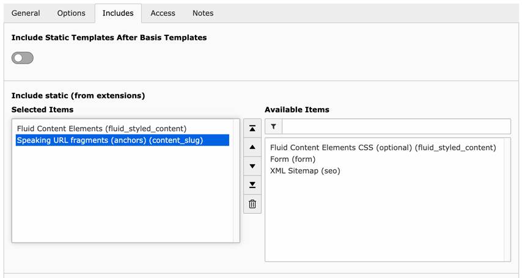

.. include:: ../Includes.txt

.. _admin-manual:

Administrator Manual
====================

.. _admin-installation:

Installation
------------

The extension needs to be installed as any other extension of TYPO3 CMS.

Perform the following steps:

#. Load and install the extension.
#. Include the static template *Speaking URL fragments (anchors) (content_slug)*
   into your TypoScript template.
#. Add permissions for the new ``tt_content`` fields ``tx_content_slug_fragment``
   and ``tx_content_slug_link`` for your editors.
#. Customize the Fluid templates, if necessary.

Get the extension
~~~~~~~~~~~~~~~~~

#. **Use the Extension Manager:** Select "Get extensions". Press the
   "Update now" button and search for the extension key **content_slug**.
   Download the latest version by using the *Import* button, or click on the
   extension's title to download a version of your choice.

#. **Get it from typo3.org:** You can download a version's ZIP archive from
   `https://extensions.typo3.org/extension/content_slug
   <https://extensions.typo3.org/extension/content_slug>`_.
   Afterwards, upload the file in the Extension Manager.

#. **Use composer**: Use ``composer require sebkln/content-slug``

You can also get the latest *dev-master* version from
`GitHub <https://github.com/sebkln/content_slug>`_ by using the command line:

.. code-block:: bash

   git clone https://github.com/sebkln/content_slug.git

Include the static TypoScript template
~~~~~~~~~~~~~~~~~~~~~~~~~~~~~~~~~~~~~~

The extension ships some TypoScript code which needs to be included.

#. Switch to the root page of your website.
#. Open the *Template* record.
#. Switch to the **Includes** tab of the template record.
#. Select **"Speaking URL fragments (anchors) (content_slug)"** in the field
   *Include static (from extensions)*. It must be loaded **after** the static
   template *"Fluid Content Elements (fluid_styled_content)"*!

   Include the static template

.. _admin-configuration:

Configuration
-------------

This extension extends EXT:fluid_styled_content and therefore provides
customized Fluid templates.

.. important::

   If you already customized the same Fluid templates for your website,
   you'll need to extend your version with some new variables and viewhelpers.

The :ref:`configuration` section covers TypoScript settings and templating.
Be sure to read :ref:`consideration` first.
