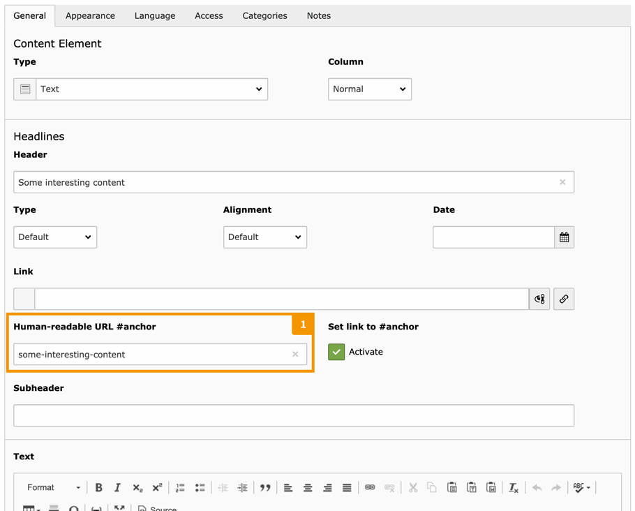
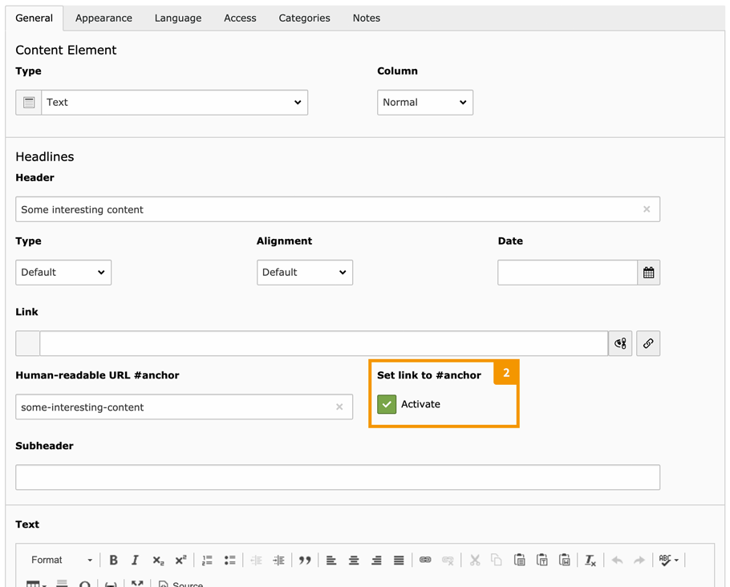

.. include:: ../Includes.txt

.. _editors-manual:

For editors
===========

.. _editors-preface:

Preface
-------

You may already know the following special *menu* content elements in TYPO3:

- *"Section index"*
- *"Section index of subpages from selected pages"*

You can use them to list one or more selected pages,
**as well as the content elements** on these pages.

If you use one of these menus on your website to navigate directly to a listed
content element, your web browser will jump right to this content!

This is also very handy if you want to share a particular section of a page
with another person.

When you follow such a link to a content element, the URL in your web browser
will look something like this:

::

   https://www.your-website.com/a-sub-page/#c123

It would be nice if ``#c123`` were more meaningful:

::

   https://www.your-website.com/a-sub-page/#c123-some-interesting-content

This extension will help you with that!

.. _editors-explanation-fragment:

1.) Getting human-readable anchors
----------------------------------

You can use the following text field to set a more readable anchor for a
TYPO3 content element:

   Text field for a human-readable URL anchor

.. _editors-fragment-syntax:

Correct syntax for URL anchors
~~~~~~~~~~~~~~~~~~~~~~~~~~~~~~

.. attention::

   Please be aware that only **a limited set of characters** can be used for
   such a URL anchor (officially called a "fragment identifier").
   These are technical limitations.

   Also, **all URL anchors on the same page must be unique!** If you use the
   same URL anchor in two or more content elements on the same page, they will
   be automatically appended with increasing numbering when saving.

   If you write a non-supported character in the URL anchor field, it will be
   **replaced** when you leave the field or save the content element.

.. tip::

   For your convenience, you can e.g. fill the URL anchor field with
   *"Learn all about Product X"*.

   When you leave the field or save the content element, it will be converted to
   *"learn-all-about-product-x"*.

**The following characters are allowed in this field:**

- ASCII characters (``a–z``)
- digits (``0–9``)
- underscores (``_``)
- hyphens (``-``)
- periods (``.``)

**As soon as you leave the field (or the content element is saved) …**

- … all characters are converted to lowercase.
- … HTML elements are removed completely.
- … space characters are converted to the hyphen character.
- … special characters (e.g. ``äöü߀``) are converted to ASCII equivalents.

.. tip::

   **Readability:** The URL anchor doesn't have to match your header exactly.
   But it will be more understandable for your website's visitor if it
   reflects the content of this text section.

.. _editors-explanation-anchorlink:

2.) Extra: Adding a new link next to the header
-----------------------------------------------

Please hover your mouse cursor over a heading in this tutorial.
Do you see the **link symbol** showing up next to it?

It allows you to navigate to this section of the page–exactly like the
menu links which were mentioned in the preface above.

If you activate this checkbox in your content element (and you filled the
URL anchor field), such a link will be added to the header:

   Checkbox to show an additional link anchor next to the header

.. note::

   You may not see this checkbox. That would mean that your administrator has
   disabled it.
