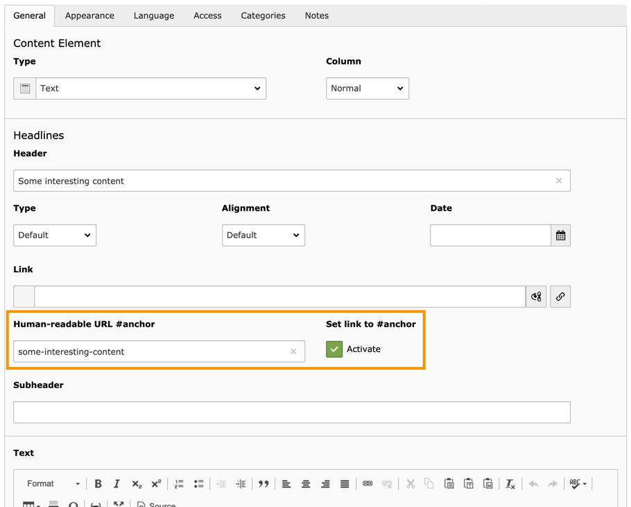

# Speaking URL fragments (TYPO3 Extension)

## Full documentation

You can find a more detailed documentation including several screenshots and how-tos on [docs.typo3.org](https://docs.typo3.org/p/sebkln/content-slug/master/en-us/) (HTML) and in the `Documentation/` folder (ReST).


## Introduction

"Speaking URLs" are a must-have feature for web pages. TYPO3 v9 and newer provide the Routing feature for this.
Former TYPO3 versions needed the third-party extensions *RealURL* or *CoolUri*.

TYPO3 also provides the navigational content elements *"Section index"* and *"Section index of subpages from selected pages"*,
which will build a list of pages and their included content elements.

These content elements will be linked by their unique id, e.g.:

```
https://www.example.org/a-sub-page/#c123
```

It's working well, but it's not human-readable.


## What does this extension do?

First of all, this extension provides **human-readable URL fragments** for TYPO3 content elements:

```
https://www.example.org/a-sub-page/#section-of-interest
```

Furthermore, the extension allows to set **anchor links** next to the header.
An editor can activate these with a checkbox for individual content elements.



### Features

- **Editors** can set individual, human-readable fragment identifiers per content element.
- **Editors** can use a button to automatically generate a fragment from the current header.
- **Editors** can activate anchor links to headers per content element.
- **Scope:** The human-readable fragment is used in *Section Index* menus, as well as for links in the RTE or TCA fields with renderType `inputLink`.
- **Fallback:** If no custom fragment is given, or the header is hidden, the default fragment is used in rendered links.
- **Evaluation #1:** Only supported characters are stored. Special characters are replaced.
- **Evaluation #2:** All content elements on the same page will get a unique fragment identifier.
- **Error prevention:** By default, the fragments are prepended with the uid of the content element.
- Of course, the Fluid templates can be customized to your needs.


## Compatibility

TYPO3 12.4.0 - 13.4.99


## Installation

The extension needs to be installed as any other extension of TYPO3 CMS.

Perform the following steps:

1. Load and install the extension.
2. Include the static template *"Speaking URL fragments (anchors) (content_slug)"* into your TypoScript template.
3. Add permissions for the new `tt_content` fields `tx_content_slug_fragment` and `tx_content_slug_link` for your editors.
4. Configure the fragment with TypoScript and customize the Fluid templates, if necessary.
